### Overview

This repository contains my work for the DeepDetect Audio Deepfake Detection Challenge hosted on Kaggle. The goal is to build models that can accurately identify whether a given audio clip is real or AI-generated.

**Final result: Rank 2 on the public leaderboard with a score of 0.99984.**

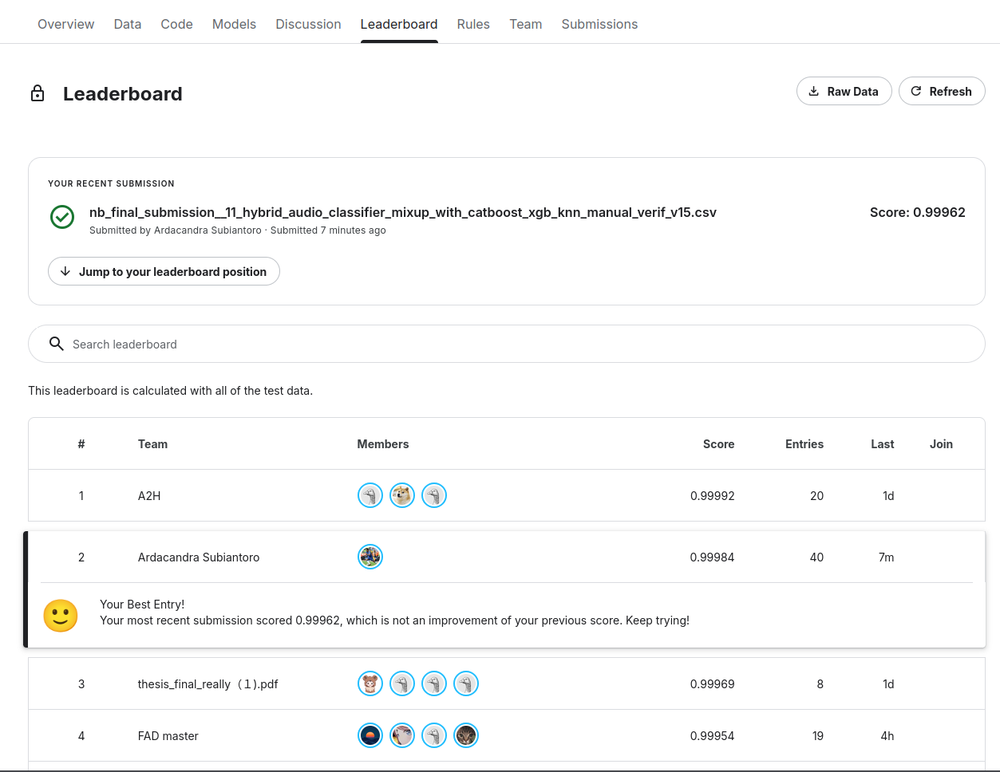

---

### Setup Instructions

1. Clone the repository

```
git clone https://github.com/Ardacandra/deepdetect_audio_deepfake_detection_challenge.git
cd deepdetect_audio_deepfake_detection_challenge
```

2. Create environment

```
conda create -n deepdetect_audio_deepfake_detection_challenge python=3.13.7
conda activate deepdetect_audio_deepfake_detection_challenge
pip install -r requirements.txt
```

3. Download the dataset

You need to place your `kaggle.json` in `~/.kaggle/` first.

```
kaggle competitions download -c deep-detect -p data/
unzip data/*.zip -d data/
```

### How to Run

1. Train network based on the specified configuration

```
python train.py --config configs/default.yaml
```

2. Get the trained network predictions on the holdout set

```
python predict.py --config configs/default.yaml
```

---

### Notebooks

| Notebook | Purpose |
|---|---|
| [nb_00_eda.ipynb](nb_00_eda.ipynb) | Exploratory data analysis of audio features and distributions |
| [nb_01_ml_feature_engineering.ipynb](nb_01_ml_feature_engineering.ipynb) | Hand-crafted audio feature extraction with librosa |
| [nb_02_ml_benchmark_models.ipynb](nb_02_ml_benchmark_models.ipynb) | Classical ML model benchmarks (LogReg, KNN, RF, LightGBM, XGBoost, CatBoost) |
| [nb_03_dl_feature_engineering.ipynb](nb_03_dl_feature_engineering.ipynb) | wav2vec2 embedding extraction |
| [nb_04_dl_models.ipynb](nb_04_dl_models.ipynb) | Feed-forward neural network on wav2vec2 embeddings |
| [nb_05_sota_model.ipynb](nb_05_sota_model.ipynb) | CNN + Transformer hybrid model with Mixup augmentation |
| [nb_06_analyzing_model_result.ipynb](nb_06_analyzing_model_result.ipynb) | Uncertainty analysis and qualitative evaluation of best model |
| [nb_final_submission_draft.ipynb](nb_final_submission_draft.ipynb) | End-to-end report combining all stages |

---

### nb_00 — Exploratory Data Analysis

**Dataset summary:**
- Training: 76,943 files — 41,731 real (54.2%), 35,212 fake (45.8%)
- Testing: 11,710 files — 6,977 real (59.6%), 4,733 fake (40.4%)
- Holdout: 14,397 files (unlabelled)
- All training real files are WAV; fake training files are 67.2% MP3 and 32.8% WAV

**Key observations:**
- Fake samples tend to be shorter in duration (mean 3.03 s) vs. real (mean 4.84 s) in training
- Real samples have higher spectral centroid (1894 Hz) vs. fake (1600 Hz)
- Zero crossing rate and RMS energy show clear separation between classes

| File Count by Split & Label | Duration Distribution |
|---|---|
| 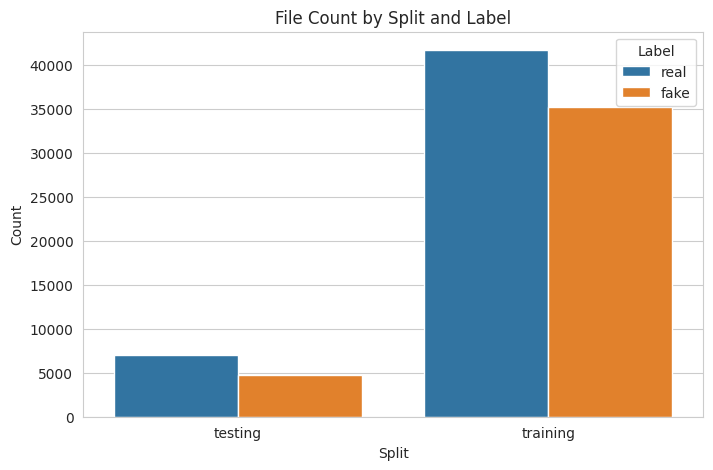 | 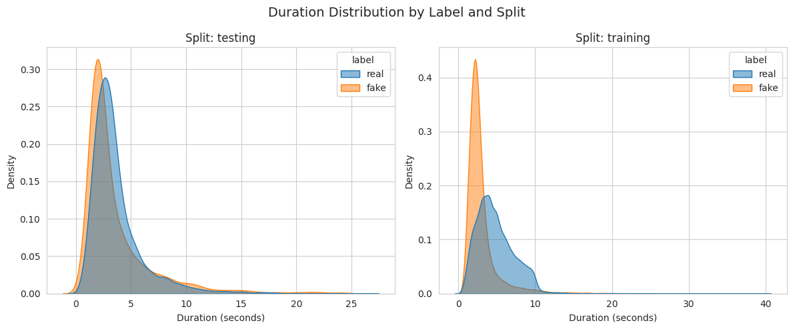 |

| RMS Energy | Spectral Centroid |
|---|---|
| 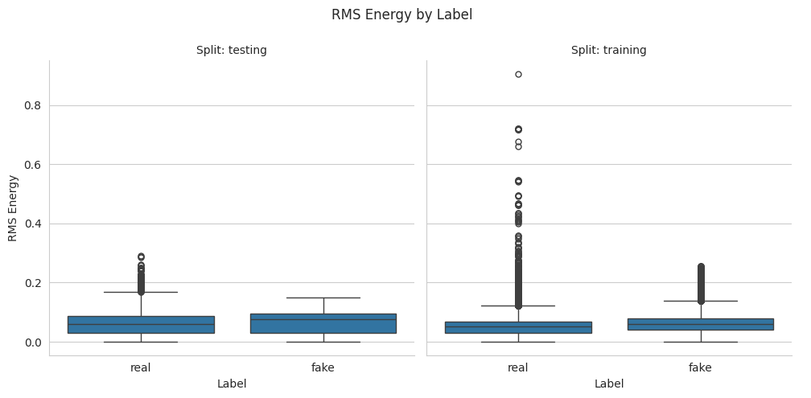 | 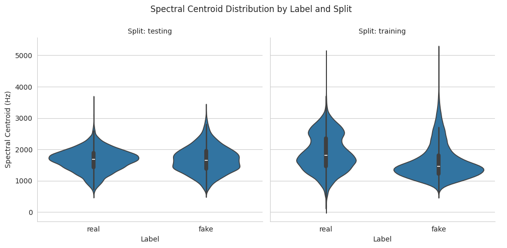 |

| Zero Crossing Rate | Feature Pairplot |
|---|---|
| 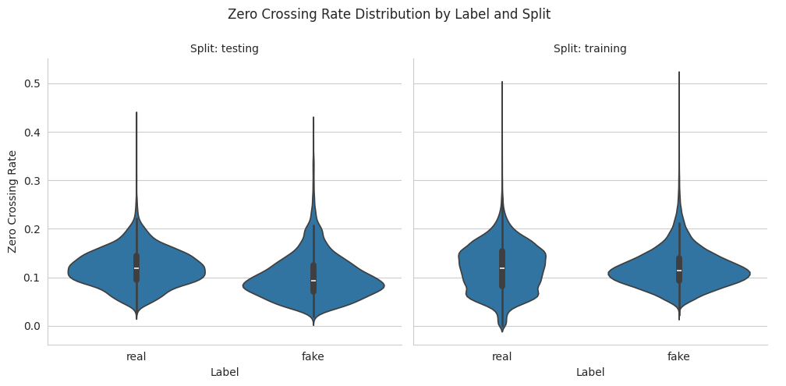 | 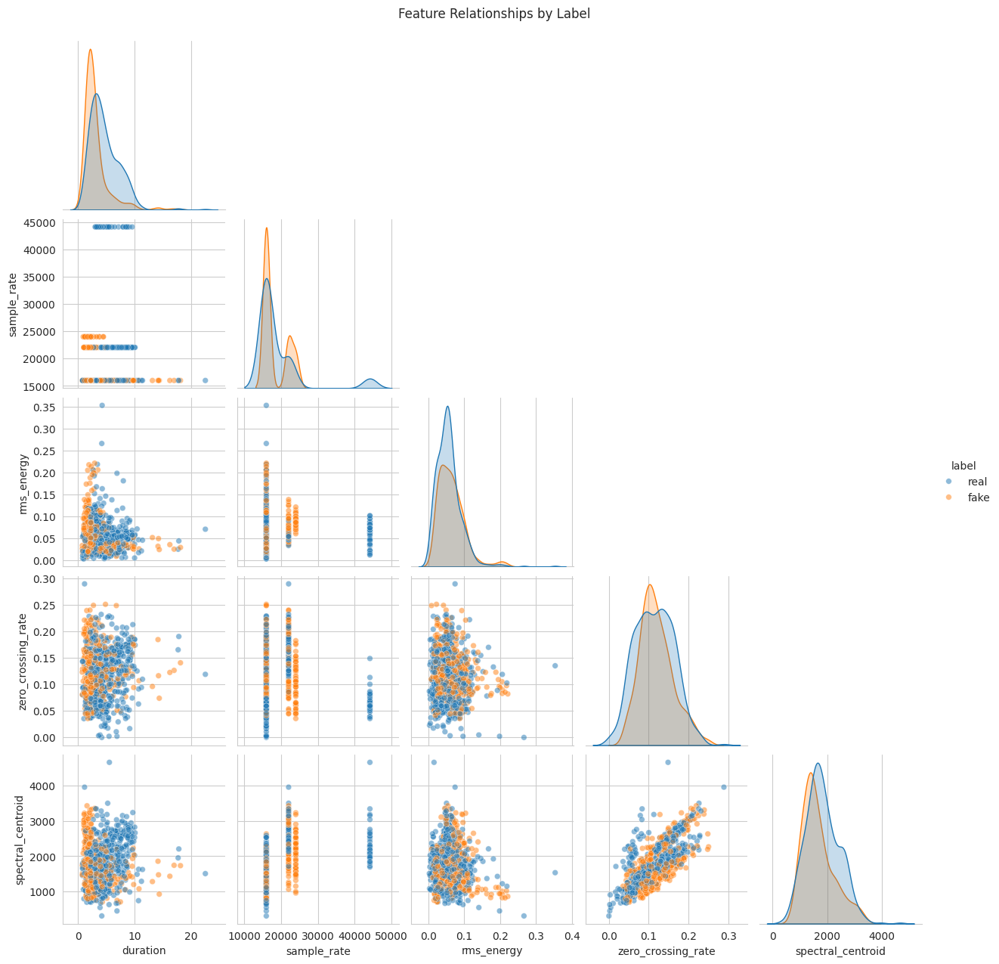 |

**Sample audio visualizations — Real WAV vs. Fake MP3:**

| | Real | Fake |
|---|---|---|
| Waveform | 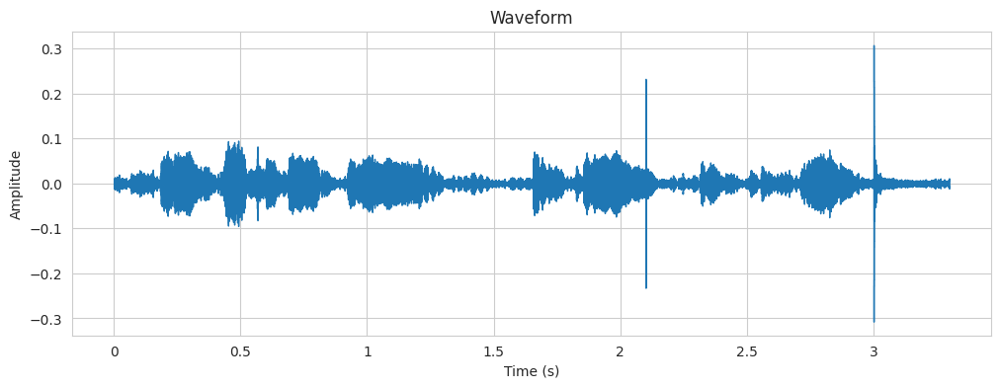 | 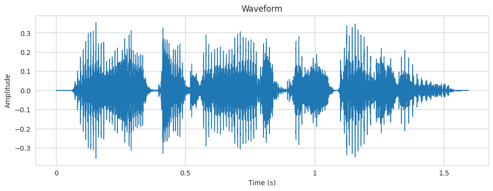 |
| Spectrogram | 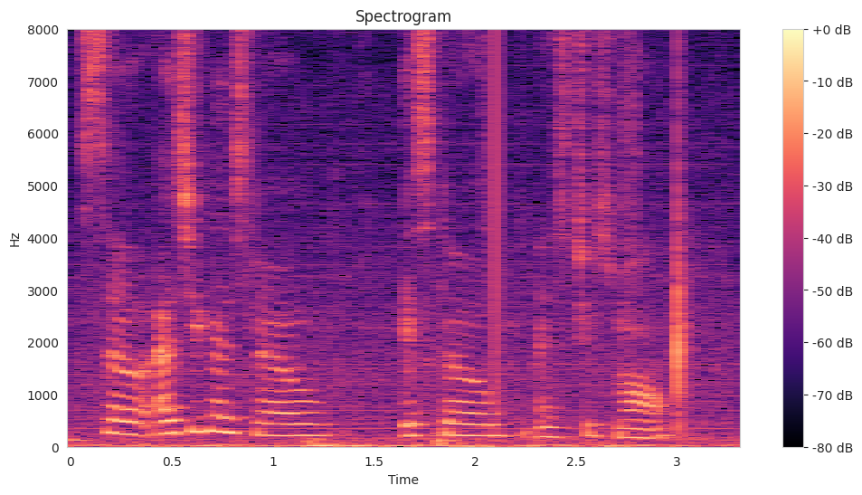 | 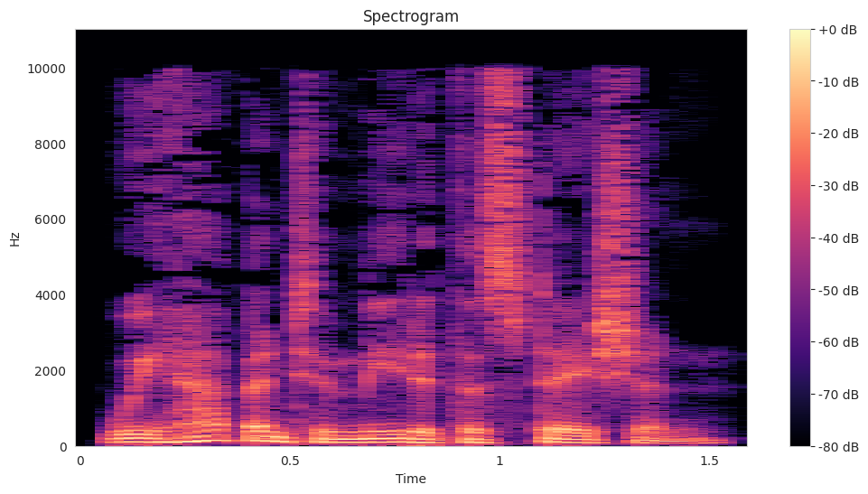 |

---

### nb_01 — ML Feature Engineering

Extracts 20 hand-crafted features per audio file using librosa: duration, sample rate, RMS energy, zero crossing rate, spectral centroid, spectral bandwidth, spectral rolloff, spectral flatness, chroma STFT (mean + std), and MFCCs 1–5 (mean + std). Processes all 103,050 files across train/test/holdout splits and saves to `output/nb_01__train_test_holdout_feats.csv`.

---

### nb_02 — ML Benchmark Models

Trains and evaluates six classical ML models on the hand-crafted features using 5-fold cross-validation.

| Model | CV F1 | Test F1 | Leaderboard |
|---|---|---|---|
| Logistic Regression | 0.8684 | 0.8498 | 0.87175 |
| KNN | 0.9867 | 0.9800 | 0.98699 |
| Random Forest | 0.9807 | 0.9727 | 0.98290 |
| LightGBM | 0.9806 | 0.9727 | 0.98324 |
| XGBoost | 0.9853 | 0.9807 | 0.98690 |
| **CatBoost** | **0.9871** | **0.9822** | **0.98888** |

| Predicted Probability Separation (CatBoost) | Top Feature Importances (CatBoost) |
|---|---|
| 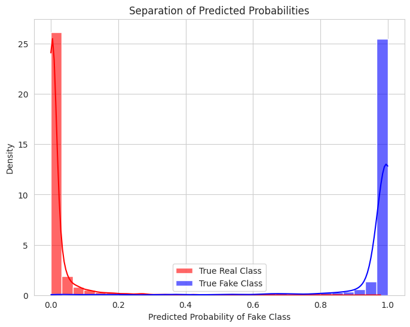 | 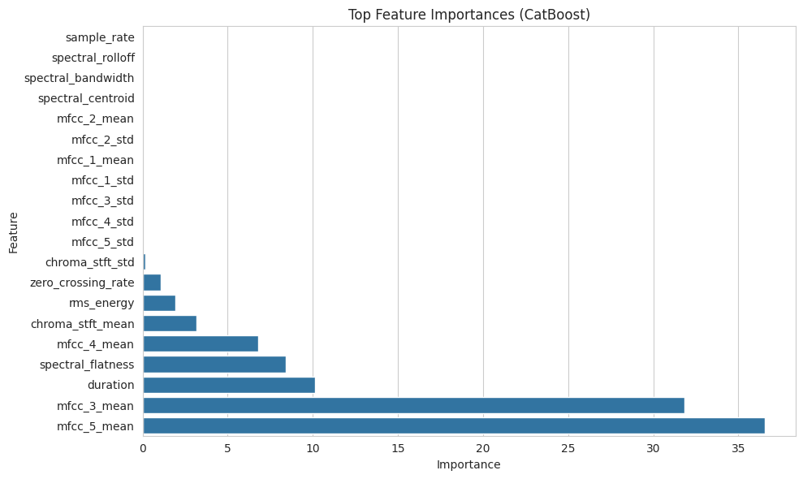 |

CatBoost achieves strong bimodal separation between real and fake predictions, with MFCC features, duration, and spectral flatness as the most discriminative features.

---

### nb_03 — DL Feature Engineering

Extracts 768-dimensional embeddings from the pre-trained `facebook/wav2vec2-base` model (12-layer Transformer) by mean-pooling the hidden states over the time dimension. One embedding vector is saved per audio file as a `.npy` file.

---

### nb_04 — DL Models (wav2vec2 + Feed-Forward Network)

Trains a 3-layer feed-forward classifier (`Linear(768→256) + BatchNorm + Dropout(0.3) → Linear(256→2)`) on wav2vec2 embeddings. Despite its simplicity, the rich pre-trained representations yield a significant boost over the best ML model.

- **Test F1: 0.9835**
- **Kaggle leaderboard: 0.99642** (vs. CatBoost: 0.98888)

| Loss vs. Epochs | F1-Score vs. Epochs |
|---|---|
| 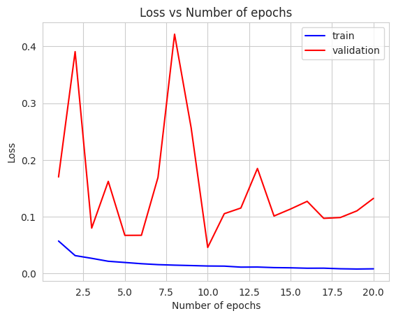 | 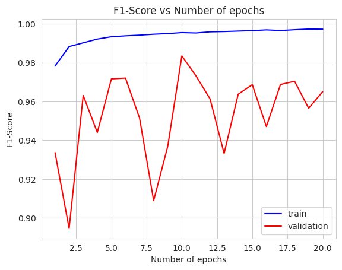 |

---

### nb_05 — SOTA Model (HybridAudioClassifier)

Trains a `HybridAudioClassifier` that processes raw waveforms through:
1. Mel-spectrogram frontend
2. CNN backbone with residual blocks and Squeeze-and-Excitation (SE) attention
3. Transformer encoder on top of CNN features

Two variants are trained: with SpecAugment only, and with SpecAugment + Mixup (α=0.2). Training uses AdamW with CosineAnnealingLR, lr=0.0001, 20 epochs, batch size=16.

| Model | Test F1 | Accuracy | Leaderboard |
|---|---|---|---|
| HybridAudioClassifier | 0.9965 | 0.9972 | 0.99870 |
| **HybridAudioClassifier + Mixup** | **0.9953** | **0.9962** | **0.99939** |

| Loss vs. Epochs (Hybrid + Mixup) | F1-Score vs. Epochs (Hybrid + Mixup) |
|---|---|
| 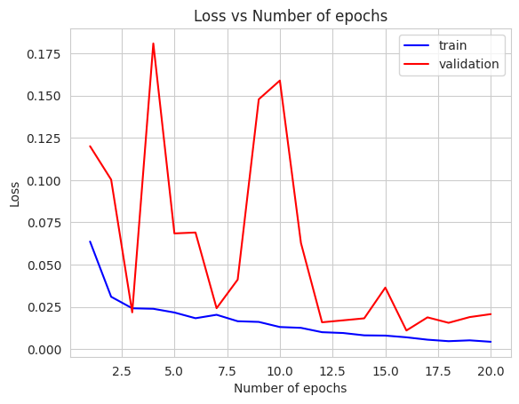 | 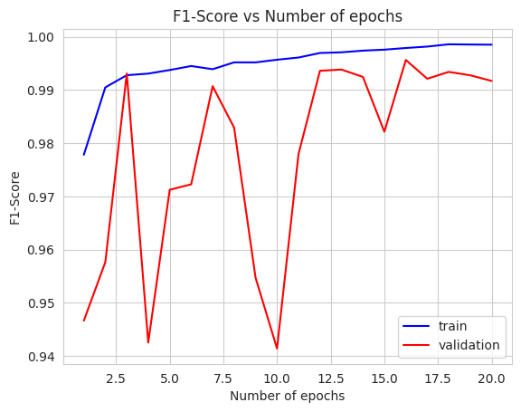 |

Extended training to 200 epochs shows clear overfitting onset after ~50 epochs, validating the 20-epoch stopping point:

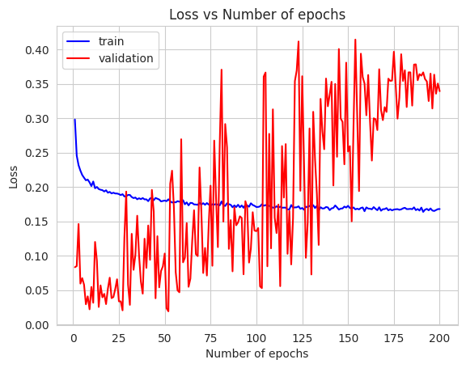

---

### nb_06 — Model Analysis & Post-hoc Refinement

Analyses predictions from the best model (HybridAudioClassifier + Mixup) on the test and holdout sets, identifies uncertain predictions (predicted probability between 10%–90%), and uses a committee of ML models (CatBoost, XGBoost, KNN) as a second opinion for those uncertain samples.

**Test set results (HybridAudioClassifier + Mixup):**
- Correct predictions: 99.57% (11,660 / 11,710)
- Incorrect predictions: 50 samples, concentrated in the 20%–45% probability range

**After ML-committee blending on uncertain samples:**
- Test F1 improved from 0.9947 → **0.9968**

| Confusion Matrix | ROC Curve |
|---|---|
| 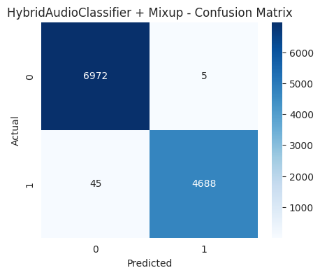 | 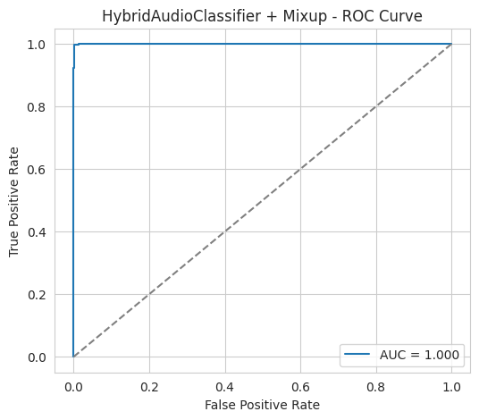 |

| Precision-Recall Curve | Probability Distribution |
|---|---|
| 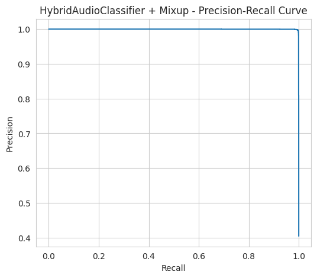 | 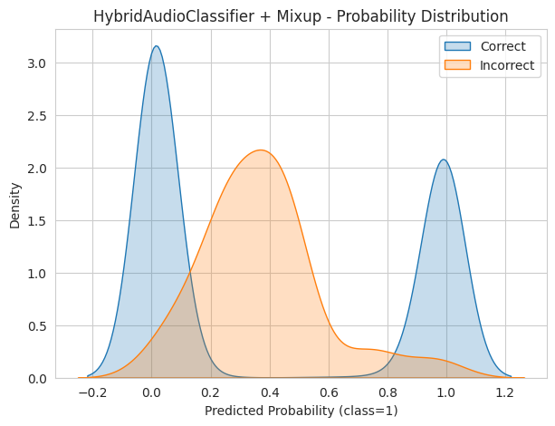 |

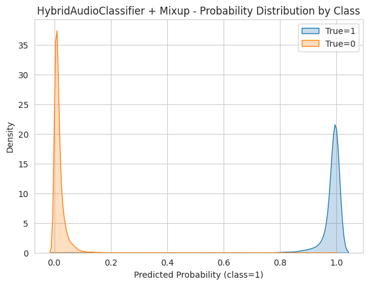

Incorrect predictions cluster in the uncertain probability zone, while correct predictions are sharply concentrated near 0 (real) or 1 (fake).

---

### Final Submission

The final submission pipeline:
1. **HybridAudioClassifier + Mixup** as the primary model
2. **ML committee (CatBoost, XGBoost, KNN)** overrides predictions in the uncertain probability range (10%–90%)
3. **Manual qualitative evaluation** of ~18 samples identified as random noise or misclassified with high confidence

| Stage | Leaderboard Score |
|---|---|
| HybridAudioClassifier + Mixup (baseline) | 0.99939 |
| + ML committee blending | 0.99962 |
| **+ Qualitative corrections (final)** | **0.99984** |
